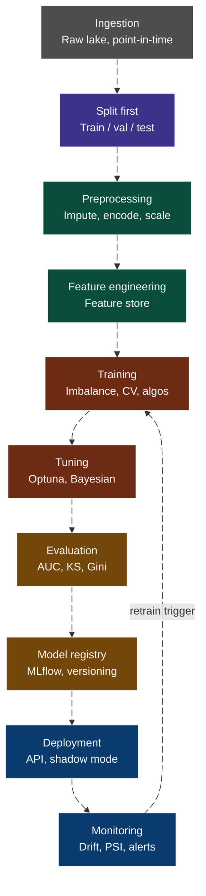

# Credit Risk Modeling E2E



### 1. Ingestion

Raw data arrives from source systems and then are landed in a data lake (S3) as immutable raw snapshots, partitioned by date. Never Overwrite data.

- **Temporal integrity**: You must know exact _point-in-time_ at which each feature was observable. If a feature uses information from the future (flag set after loan is approved), that's leakage before modeling start.

### 2. Split data

Before touching a single null value, you must split your data into train/validation/test. In credit risk the split must be **temporal** (not random).

If you impute missing values (e.g., fill median income) using the full dataset before splitting, the test set leaks information about itself into the training imputer. Same with scalers, encoders, and any aggregation. Fit all transformers on train only, then transform val and test.

### 3. Preprocessing

Missing values can be handled, fit imputers must be applied on train dataset only.

- For numeric features, median imputation is the default (robust for outliers)
- For categorical features, a separate _"missing" category_ often outperforms dropping or mode-filling because tree models can actually learn from _"this value was absent"_
- Scaling (`StandardScaler`, `MinMaxScaler`) is only strictly needed for _Logistic Regression_
- Tree ensembles (`XGBoost`, `LightGBM`, `CatBoost`, `Random Forest`) are _scale-invariant_

Outlier may be cap at 1st/99th percentile rather than remove rows to not throw away important events.

### 4. Feature Engineering & Feature Store

Ratios perform a very important role:

- **CREDIT_INCOME_RATIO**
- **ANNUITY_INCOME_RATIO**
- **EMPLOYED_TO_AGE_RATIO**

Bureau aggregations also:

- **number** of past delinquencies
- **max** overdue days
- **total** credit exposure

Temporal Features:

- **days** since last application
- **time** employed at current job

Those features should live in a feature store (_Feast_, _Tecton_, _Hopsworks_). The feature store serves two purposes:

- It ensures the exact same feature computation logic runs at training time and at inference time (preventing train/serve skew, another form of leakage)
- It lets multiple teams reuse features without recomputing them

### 5. Training - Imbalance, cross-validation and algorithm choice

Imbalance is a great challenge, with ~8% default rate, a naive model predicts "no default" 92% of the time and gets 92% accuracy.

Options:

- `class_weight='balanced'` or `scale_pos_weight` in `XGBoost`/`LightGBM` is a simple fix and works well
- **SMOTE** (synthetic oversampling) can help but must be applied inside _cross-validation_ folds, not before, otherwise synthetic samples from the training fold leak into the validation fold.
- Threshold tunning at inference, instead of defaulting to 0.5 move the decision threshold based on the business cost matrix (cost of missed > cost of false alarm in a bank)

#### Cross Validation

- Use `StratifiedKFold` (preserves class ratio per fold) with 5 folds
- For temporal data, use `TimeSeriesSplit` instead, **never shuffle time-ordered data**
- **SMOTE** must go inside the pipeline so it only sees each training fold.

#### Algorithm tradeoffs

`Logistic Regression` is the baseline, fast, interpretable, regulatory-friendly. But struggles with non-linear relationships and feature interactions, it needs manual feature engineering.

`Random Forrest` handles non-linearity well, robust to outliers, less prone to overfitting than single trees, built-in feature importance. Slower to train than gradient boosters, less accurate on tabular data at scale.

`XGBoost`, `LightGBM` and `CatBoost` are the industry standard for tabular credit data:

- `LightGBM` is fastest on large datasets
- `CatBoost` handles categorical features natively (no need for target encoding tricks) and is particulary good when you have high cardinality categorical like occupation or city.
- `XGBoost` is the most battle-tested in production

All three support `scale_pos_weight` for imbalance and produce SHAP values for explainability.

`KMeans` and `DBScan` are _unsupervised_, used differently. `KMeans` for customer segmentation before building segment specific score cards. `DBScan` for anomaly detection (fraud, unusual application patterns) or identifying clusters that have suspicious high/low default rates, which then become features.

### 6. Hyperparameter tuning

Do not grid search, use `Optuna` (Bayesian optimization). It learns which hyperparameter regions are promising and focus there. For `LightGBM` and `XGBoost` the most usual are `num_leaves`, `max_depth`, `learning_rate`, `min_child_samples` and `subsample`.

- Use early stopping against validation AUC prevents overfitting and saves compute

Tune on validation, report final performance on test (which is touched exactly once).

### 7. Evaluation

- Accuracy can be misleading, `AUC-ROC` is the standard, it measures rank-ordering ability across all thresholds
- `Kolmogorov-Smirnov` measures the maximum separation between default and non-default score distributions
- `AUC-PR` (precision-recall) is more informative than `ROC` when positives are very rare
- Calibration check (Brier score, reliability diagram), your predicted probabilities should actually mean what they say (a 20% predicted default rate should default ~20% of the time), especially if you're using the score as a probability estimate for provisioning.
- `SHAP` values for feature importance, not just globally but per-prediction. Regulators in Brazil (BACEN), Europe (ECB), and the US (OCC) increasingly require you to explain individual decisions.

### 8. Model Registry

When a model pass evaluation gates, register in the model registry, store the model artifacts, all hyperparameters, training dataset hash, evaluation metrics, feature importance, environment (`requirements.txt`), and a link to the training run. Tag it as `staging`, `production`, `achieved`, this is essential for model risk management (MRM) reviews.

### 9. Deployment

Wrap the model in a _REST API_, at inference, features are fetched from the online feature store (low latency key-value store like _REDIS_), the same features computed at training time, preventing _serve skew_.

Usually the deploy has to be made first in **shadow mode**: the new model runs in parallel with the champion but it's decisions don't count. You compare output distributions. Then A/B test with a small traffic slice. Only then it become the champion.

### 10. Monitoring

- **Data Drift**: PSI — Population Stability Index on input features, PSI > 0.2 is a red flag
- **Concept drift**: has the relationship between features and default changed? Monitor AUC on labeled outcomes as they mature, usually 3–6 months lag for credit
- **Output drift**: is the score distribution shifting?

Set automated retraining triggers. In credit markets, macroeconomic shocks (interest rate hikes, unemployment spikes) can invalidate a model within weeks.

## Considerations

- The feature store has no concept of _train/val/test_. That's a model training concern, not a data concern
- The feature store's job is to serve features correctly for any entity at any point in time
- The training pipeline asks Feast for a historical dataset, gets back a flat dataframe, and then splits it
- The split logic is versioned inside the training code, logged to MLflow alongside the model
- The **gold layer on S3** is Feast's offline store. It's the materialized, engineered feature parquet files that Feast indexes and serves for historical training retrieval. You write to it from your Glue job. Feast reads from it when you call `get_historical_features()`
- The DynamoDB table is _Feast's online store_. It holds only the latest feature value per entity. You populate it by running `feast materialize`. The inference API calls `get_online_features()` against DynamoDB, getting sub-10ms latency
- The _Glue job_ writes to gold/S3. It does not split. It does not impute. It does not scale. It engineers features for every entity, for every date partition
- The training pipeline then asks _Feast "give me all features for these entity IDs at these timestamps"_ and gets back a single flat dataframe. That's where the **split** and **preprocessing** pipeline runs — inside _SageMaker_, on that retrieved dataframe
- The feature store serves both **training** and **inference** using identical feature computation. The preprocessor _(imputer, scaler, capper)_ is a **model artifact**. It belongs to a specific model version, stored alongside the model in MLflow. A new model version might use different capping thresholds. That's fine, it's versioned in MLflow. But the features themselves are shared across all models and all teams

## Running Locally

1. Run the containers:

```sh
make up
```

2. Go to airflow web server and run the `credit_risk_pipeline_dag.py` ingestion DAG

3. Verify if files were created:

```sh
aws --endpoint-url=http://localhost:4566 s3 ls s3://data-lake/ --recursive
```

## Useful commands

- Check repository in _github_ url

```sh
gh repo view --web
```

- Docker containers resource consumption:

```sh
docker stats --format "table {{.Name}}\t{{.CPUPerc}}\t{{.MemUsage}}\t{{.MemPerc}}"
```

Airflow UI Retries:

- Retry: same TaskInstance, same compiled command, just runs again
- Clear: new TaskInstance built from current DAG file on disk

## References

- [Sagemaker Pipeline Local Mode](https://developers.cyberagent.co.jp/blog/archives/58870/)
- [scikit_learn_bring_your_own_container_local_processing](https://github.com/aws-samples/amazon-sagemaker-local-mode/blob/main/scikit_learn_bring_your_own_container_local_processing/scikit_learn_bring_your_own_container_local_processing.py)
- [scikit_learn_bring_your_own_container_and_own_model_local_serving](https://github.com/aws-samples/amazon-sagemaker-local-mode/tree/main/scikit_learn_bring_your_own_container_and_own_model_local_serving)
- [feast.dev docs](https://rtd.feast.dev/en/latest/#feast.repo_config.RepoConfig)
- [sagemaker-pipelines-bridging-the-gap-between-local-testing-and-deployment](https://aws.plainenglish.io/sagemaker-pipelines-bridging-the-gap-between-local-testing-and-deployment-b5fcd8694b80)
